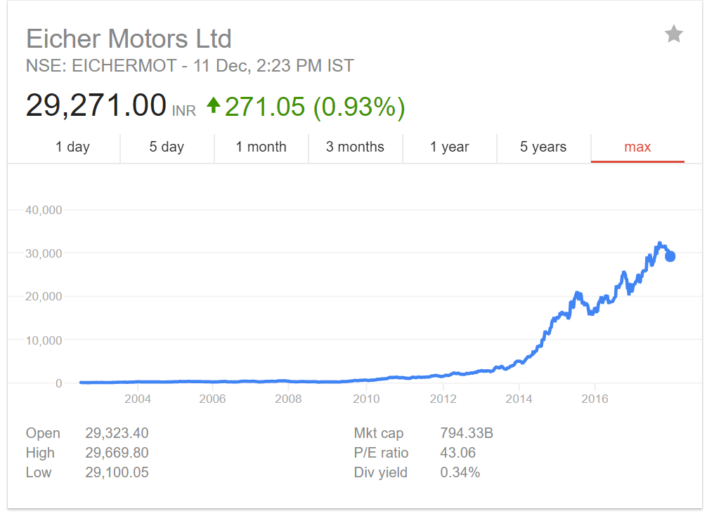

On the afternoon of 30th of May, 2002, After waiting in queue for 10 minutes at a bank in Mumbai, Rohan finally got his bank account statement printed on his passbook. The final balance read at **Rs 2,35,000.000**. He was overjoyed. He had finally saved up enough to buy his dream bike, a Royal Enfield. He wasted no time in rushing to the showroom and booking his bike.

Behind him, in the queue, stood Mohan patiently. Mohan was Rohan’s best friend from his college days and both of them had received job offers in the same company with the same financial compensation. Mohan had also come to the bank to get his bank statement printed. Unlike Rohan, his account statement read only **Rs 50,000.000**.

Mohan in his summer vacation spent a week helping his uncle who ran a brokerage. His uncle taught him about the value of saving and investing money. He also taught him how to analyze stocks and invest in them. Mohan spent a good one month in understanding the markets in depth and decided to invest in Eicher Motors. On June 1st, he had invested Rs 1,75,000.000 in total in Eicher Motors, the maker of Royal Enfield.

**15 Years Later …..**

Mohan’s investment of Rs 1,75,000 in Eicher Motors is now worth ….. wait for it ….. **Rs. 5,45,59,042.000**. How did this happen? Let us look at the stock price of Eicher Motors.

In July 2002, the stock price was Rs 94.20, which got Mohan 1857 shares. Now each of those shares is worth Rs 29,271 each.

The important lesson that Mohan’s uncle had taught him that summer was the power of long-term investing and Compound Interest, which is rightly called the Eighth Wonder of the World.

> Compound interest is the eighth wonder of the world. He who understands it ,earns it … he who doesn’t … pays it.
> - Albert Einstein

Compound Interest would be something that you would have heard of in your school days, but it is something that deeply affects your financial position depending on how you leverage it.

We all know the formula for simple interest is :

I = PTR / 100

and the formula for compound interest is :

$$M = P( 1 + i )^n$$

M = final total that includes the principal and all interest
P = principal amount
i = interest rate/100
n = number of years

Here, the variable n which represents the number of years is the magic number. Look at the below graph and their investing saving habit to better understand compounding.

Investment of Chris has given him a return of 500%+ on his investment. All of which he should be thankful for compounding of his investments. These returns are calculated at 7 %, which risk-free Fixed Deposits at Indian Banks provide annually. Had he invested in instruments that provided higher returns ( For Example, Mutual Funds, Bonds, and Equity), his net worth currently would have been monumental.

But wait, Compounding is a double-edged sword, if you do not use it right, it can come back to hurt you and work on your wealth building efforts.

Credit cards and Loans use compounding against you. Credit cards make you pay interest on the outstanding amount at the end of each month and banks while calculating mortgages, factor in compounding, which makes you pay a lot more than you would have if simple interest was to be used.

For the above discussion, one point is clear. Beginning your investment journey early and having compounding as your friend pays off really well in the future.

Now that you have agreed that these investments do pay off really well, but where should you invest?

Well, this all depends on our risk- appetite. It is just a fancy term to indicate how much can you tolerate to lose that money. For example, people with low risk-appetite are suggested to invest in savings account/ Fixed Deposit. These are very low-risk instruments which give returns of 4% and 6.25% annually but are very safe. By safe here, I mean that your money is guaranteed to not lose its value. On the other hand, Mutual Funds and Stock Markets give average returns of 11% and 14% respectively, but they are riskier. It means that you may or may not get as high returns and sometimes may get negative returns, i.e you may lose money.

Some of the instruments to look into if you are planning to invest are :

Short-term investing

 - Savings bank account: Your Regular bank account where you keep all your money. It proves a nominal 4% return annually.
 - Money market funds: They are also known as a risk-free Mutual Funds. They offer better returns than savings account without compromising liquidity. Reliance Smart Deposit is one such example of Money Market Funds. They usually invest in safer debt-instruments and provide returns up to 6–7%.
 - Bank fixed deposits: As previously mentioned.FDs are very safe investment options providing returns up to 6–7 %.

Long-term Investing

 - Post Office savings
   Similar to bank account, Low risk and no Tax deduction at Source(TDS)
 - Public Provident Fund
   Best fixed-income investment for high taxpayers and Long-term investment. Your money will be locked-in for 15 years. Returns will be 7–8% annually as decided by GoI.
 - Company fixed deposits
   Option to maximise returns within a fixed-income portfolio
 - Bonds and debentures
   Option for large investments or to avail of some capital gains tax rebates
 - Mutual Funds
   Mutual Funds are a group of stocks put together in a portfolio and sold as units. They are managed by a professional fund manager and the portfolio is managed to be risk-averse. The average returns vary depending on the type of fund.
 - Life Insurance Policies
   Life Insurence policy along with coverage can act as an investment where the amount is returned to you upon its maturity depending upon your policy.
 - Equity shares
   Equity shares have the potential of generating very high returns depending upon the quality of the share chosen and traded by you. A lot of investors, including Warren Buffet, have made their money by investing in successful companies and letting their money grow along with the company.

For more information on each of these, visit this link.: [Investment Instruments](http://www.moneycontrol.com/planning_desk/fininvoption.php)
