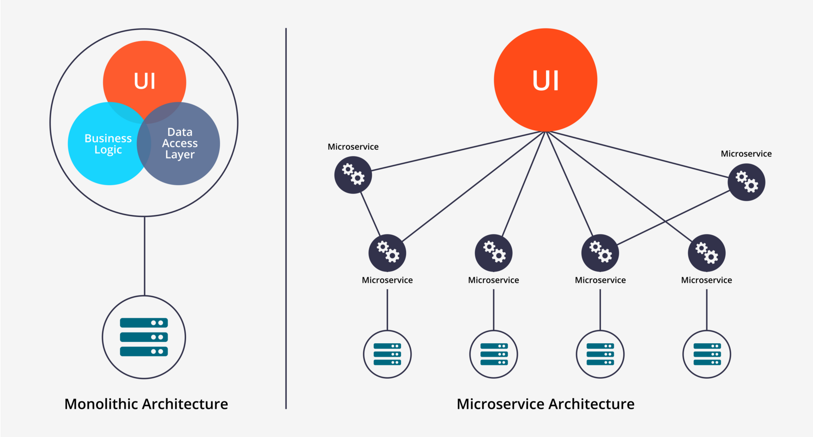

Its been more than a month here at [Microland](https://microland.com/) as a Technology Intern in its Cloud Centre of Innovation working on my project titled "Embedded Business Monitoring of microservices architecture through an SDK". Since my project mostly deals with microservices architecture, I had the opportunity to explore and be fascinated by the numerous advantages that microservices provide over monolithic architecture and how it is truly closer to a business objective. It isn't only me whos fascinated, companies such as Google, Netflix, eBay are too and have adopted microservices for their various products and services. Google has recently open sourced Kubernetes, its orchestration platform in support of this new, revolution, you may call it.I wanted to share whatever I have learnt with people trying to start with microservices and hence this post.

Let us first understand what is meant by the two architecture in comparison here: **Monolithic** and **Microservices**.

On the left, we see the traditional **monolithic** application which has existed for quite some time. This application is developed as a single entity. Usually, monolith applications consist of three distinct parts, the user front-end, a database which stores data and a back-end which handles functional login, works on data retrieved from the database and assembles it as a code (HTML) to send it to the browser for the user to view it.

For those of you who are familiar with web development might be aware of what I am talking about. A single application is developed and hosted on a server.

On the right, a **microservices** architecture is a architecture or a software design pattern in which a larger application( the monolith application we earlier talked about) is composed of multiple smaller services ( think of them as smaller functional units), each with its own objective or goals, that collaborate and communicate to complete the functionality of the application. Within a microservices architecture, each service runs in its own process and communicates with other processes using a lightweight mechanism such as HTTP/REST with JSON.

Let me try to explain both with an example

Consider an application which allows a registered user to search for tweets with a keyword and perform sentiment analysis on it. In a monolith application, this is all coded and packed up within a single web application and hosted on a server. If we were to design it as a microservice architecture, we would broadly split the core business logic of the application into the following separate services:

 - User Sign up
 - User Login and Authentication
 - User Dashboard
 - Twitter Scraping
 - Sentiment Analyser
 - Results Dashboard

The reason for bringing up this example was for us to understand the pros and cons of each through this example.

Now let me tell you why monolithic may be a pain in the a** sometimes. As the application grows in size and complexity, it can be difficult to maintain the original codebase, making development messier.

The application's scalability suffers since the entire application must be made scalable - as opposed to only those parts that are in greater demand. This, accordingly to me, is the biggest plus point of a microservices architecture, that each service is independently scale-able. Let me tell you why this is so important using the Twitter analyzer app example I mentioned earlier. Consider this scenario when some executive of Nestle wants to understand what Twitter thinks about KitKat, the chocolate bar. The application processes it, runs smoothly and returns the result as expected. Now suppose in another situation on US election day, some journalist wishes to know how Twitter is reacting to Donald Trump being elected as president. How do you think our system will react if it were a monolith application? It would crash because it couldn't scale to meet the demands of processing millions of tweets as requested by the user! But let us see if it were microservices with a well-designed orchestration ( Fancy word for service management), it would spring up new containers ( a place where these services are run) and scale smoothly. Once this processing is done, the containers would die and return back to its original state.

Another important factor being that services can be scaled independently. If it were a microservices application, it would make more sense to have more containers running the Login Service more than the Sign Up Service. You get the idea.

In addition, changes and updates to the application require the entire application to be rebuilt and redeployed, which can cost valuable time and effort. This comes in handy because this design pattern involves complete teams being responsible and meeting goals for technical and business aspect of the organization. This lets them function independently and reduces their dependence on Ops team as well as rest of the development team to deploy their application. This not only improves the development speed but also go to market speed for the organization with quick and different iterations of their product responding to user feedback.

Another key advantage which the developers would love is the possibility of using different tech stacks within the same application. For example, the User Sign Up and Login could use the Django-Auth available on Github Meanwhile the Dashboards would be built with NodeJS using WebSockets and the sentiment analyzer would be achieved through R.

Now that we know about the architecture in theory, how do we actually implement it in a real world application? I shall explain it with an example tutorial in my next post. Subscribe and stay tuned to find out more.Cheers!